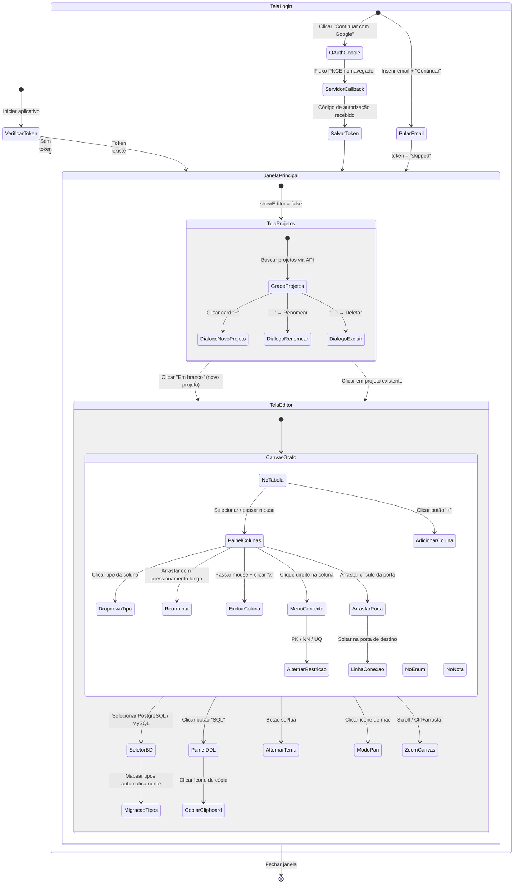

```mermaid
stateDiagram-v2
    [*] --> VerificarToken: Iniciar aplicativo

    state VerificarToken <<choice>>
    VerificarToken --> TelaLogin: Sem<br>token
    VerificarToken --> JanelaPrincipal: Token<br>existe

    state TelaLogin {
        [*] --> OAuthGoogle: Clicar "Continuar com Google"
        [*] --> PularEmail: Inserir email + "Continuar"
        OAuthGoogle --> ServidorCallback: Fluxo PKCE no navegador
        ServidorCallback --> SalvarToken: Código de autorização recebido
        SalvarToken --> JanelaPrincipal
        PularEmail --> JanelaPrincipal: token = "skipped"
    }

    state JanelaPrincipal {
        [*] --> TelaProjetos: showEditor = false
        TelaProjetos --> TelaEditor: Clicar "Em branco" (novo projeto)
        TelaProjetos --> TelaEditor: Clicar em projeto existente

        state TelaProjetos {
            [*] --> GradeProjetos: Buscar projetos via API
            GradeProjetos --> DialogoNovoProjeto: Clicar card "+"
            GradeProjetos --> DialogoRenomear: "..." → Renomear
            GradeProjetos --> DialogoExcluir: "..." → Deletar
        }

        state TelaEditor {
            [*] --> CanvasGrafo

            state CanvasGrafo {
                NoTabela --> PainelColunas: Selecionar / passar mouse
                PainelColunas --> DropdownTipo: Clicar tipo da coluna
                PainelColunas --> Reordenar: Arrastar com pressionamento longo
                PainelColunas --> ExcluirColuna: Passar mouse + clicar "x"
                PainelColunas --> MenuContexto: Clique direito na coluna
                MenuContexto --> AlternarRestricao: PK / NN / UQ
                PainelColunas --> ArrastarPorta: Arrastar círculo da porta
                ArrastarPorta --> LinhaConexao: Soltar na porta de destino
                NoTabela --> AdicionarColuna: Clicar botão "+"
                NoEnum
                NoNota
            }

            CanvasGrafo --> PainelDDL: Clicar botão "SQL"
            CanvasGrafo --> SeletorBD: Selecionar PostgreSQL / MySQL
            SeletorBD --> MigracaoTipos: Mapear tipos automaticamente
            CanvasGrafo --> AlternarTema: Botão sol/lua
            CanvasGrafo --> ModoPan: Clicar ícone de mão
            CanvasGrafo --> ZoomCanvas: Scroll / Ctrl+arrastar

            PainelDDL --> CopiarClipboard: Clicar ícone de cópia
        }
    }

    JanelaPrincipal --> [*]: Fechar janela
```
